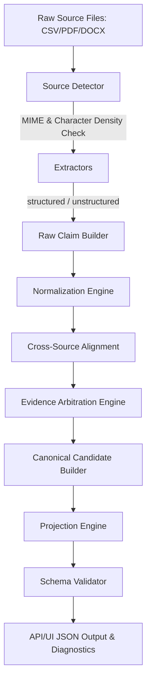

# Multi-Source Candidate Data Transformer: A Trust-Aware Evidence Fusion Pipeline

The **Multi-Source Candidate Data Transformer** is a production-grade, trust-aware evidence fusion pipeline written in Python. It ingests heterogeneous candidate profile data from multiple structured (CSV spreadsheet) and unstructured sources (resumes in PDF, scanned/image PDF, and DOCX formats), aligns them by identity, arbitrates competing evidence using an evidence-based consensus system, projects the resolved canonical profile into client-defined JSON payloads at runtime, and runs validation models to produce schema diagnostics—all while preserving full provenance and confidence metrics for every decision.

---

## 1. Core Architecture Flow

The pipeline executes a strict 11-stage, type-safe, claim-based ingestion lifecycle:



### Detailed Execution Stages

1. **Input Validation (`pipeline.py`)**
   - Pre-flight asserts check that incoming file paths are provided. 
   - Ensures at least one source file (CSV or resume) is provided before loading dependencies.
2. **Source Detection (`source_detector.py`)**
   - inspects file header bytes (magic numbers) rather than relying on file extensions alone.
   - For PDF documents, calculates character-to-page density (less than 100 characters in the first 3 pages flags the PDF as scanned).
3. **Claims Extraction (`csv_extractor.py`, `resume_extractor.py`)**
   - Parses structured CSV rows mapping fuzzy column name heuristics (e.g. "Candidate Name", "full_name") to target properties.
   - For resumes, segments layouts using standard header indicators (EXPERIENCE, EDUCATION, SKILLS, CONTACT) to isolate regex searches.
   - Initiates OCR fallback (via easyocr) on scanned image PDFs.
4. **Claim Compilation (`models.py`)**
   - Encapsulates every raw value into an immutable `Claim` schema documenting:
     - Extraction field
     - Raw value & normalization history
     - Document source filename
     - Extraction method (e.g., column mapping, regex contact block, heuristics)
     - Extraction position in document (e.g., explicit field, contact block, prose body)
     - Initial raw confidence score
5. **Normalization Engine (`normalizer.py`)**
   - Sanitizes names to Title Case.
   - Standardizes phone numbers to strict E.164 formats using Google's `phonenumbers` library.
   - standardizes timelines and verbal month keywords (e.g., "Present", "Current") into `YYYY-MM` formats relative to the pipeline's runtime timestamp.
   - Maps country text matching major lists to ISO-3166 Alpha-2 country codes.
   - Maps skill listings onto a structured taxonomy ontology using fuzzy token alignments.
6. **Evidence Alignment & Identity Resolution (`arbitration.py`)**
   - Groups all normalized evidence claims by the candidate's primary email identity (SHA-256 hashed to protect identity).
7. **Evidence Arbitration (`arbitration.py`)**
   - **Union Strategy**: Pools and dedupes list-based evidence (emails, phones, skills, experience, education). Identical entries receive a **+0.15 corroboration confidence bonus**.
   - **Highest Confidence Strategy**: Resolves single-value evidence fields (full name, location, headline) based on source and method trust weights.
   - **Conflict Detection**: Flags fields where competing evidence claims have a close confidence margin (<= 0.05).
8. **Experience Years Union (`arbitration.py`)**
   - standardizes dates of work roles to monthly ranges and projects them on a single chronological timeline.
   - Dedupes overlapping freelance contracts or parallel jobs using interval range union math, calculating a net sum of years of experience rounded to 1 decimal place.
9. **Canonical Candidate Builder (`canonical_builder.py`)**
   - Consolidates arbitrated values and provenance records to compile a secure `CanonicalCandidate` object with a unique SHA-256 ID.
10. **Projection Engine (`projector.py`)**
    - Dynamic re-mapping of the canonical profile to custom JSON objects based on the projection configuration.
11. **Schema Validator (`validator.py`)**
    - Validates the projected output against expected Pydantic structures, logging warning and error diagnostics.

---

## 2. Ingestion Field Schemas

### Default (Canonical) Output Schema
This represents the raw, un-flattened, un-projected candidate profile structure produced by the builder:

| Field | Type | Description |
| :--- | :--- | :--- |
| `candidate_id` | `string` | Unique SHA-256 hash generated from the primary email. |
| `full_name` | `string` | Title-case formatted candidate name. |
| `emails` | `string[]` | Array of RFC 5322 valid email addresses. |
| `phones` | `string[]` | Array of E.164 formatted phone numbers. |
| `location` | `object` | `{ city, region, country }` (country: ISO-3166 Alpha-2 code). |
| `links` | `object` | `{ linkedin: string, github: string, portfolio: string[], other: string[] }` |
| `headline` | `string` | Headline or short self-summary. |
| `years_experience`| `number` | Programmatically computed non-overlapping years of work history. |
| `skills` | `object[]` | Array of `{ name, confidence, sources[] }` skill entries. |
| `experience` | `object[]` | Array of `{ company, title, start, end, summary, concurrent, sources, confidence }` |
| `education` | `object[]` | Array of `{ institution, degree, field, end_year, sources, confidence }` |
| `provenance` | `object[]` | Deep audit log tracking resolution strategy, winning values, and claims. |
| `overall_confidence`| `number` | Weighted confidence score from 0.0 to 1.0. |
| `pipeline_run_timestamp`| `string` | ISO-8601 Zulu timestamp of the pipeline run execution. |
| `sources_processed` | `string[]` | List of filenames analyzed for this profile. |
| `warnings` | `string[]` | List of non-fatal execution warnings. |

---

## 3. Configuration & Reshaping Engine

The projection configuration reshaping system maps paths inside the canonical candidate to custom outputs.

### Global Settings Toggles
- **`include_confidence` (boolean)**: Set to `true` to retain `overall_confidence` and skill-level confidence scores in the output; set to `false` to strip them.
- **`include_provenance` (boolean)**: Set to `true` to keep the audit trail (`provenance`) in the output; set to `false` to strip it out entirely.
- **`on_missing` (enum)**: Determines behavior when a mapped field resolves to null:
  - `"null"`: populates the field value as `null`.
  - `"omit"`: removes the field key from the JSON output.
  - `"error"`: throws a `ProjectionError` halting execution.

### Field Specification Mappings
Each field mapping in `fields` requires:
- **`path` (string)**: The key name inside the output payload.
- **`from` (string, optional)**: The dot-notation path pointing to the field in the canonical candidate profile (e.g. `emails[0]`, `experience[0].company`, `links.github`). If omitted, defaults to the target `path` name.
- **`type` (enum)**: Validates target types. Allowed types are:
  - `"string"`: Coerces the resolved value to a string.
  - `"string[]"`: Formats the value as a list of strings.
  - `"number"`: Coerces the value to a floating-point number.
  - `"boolean"`: Converts the value to a boolean.
  - `"object"`: Retains the nested dictionary structure (e.g., location, links).
  - `"object[]"`: Retains lists of dictionaries (e.g., experience, education, provenance).
- **`normalize` (enum, optional)**: Applies re-normalizations on the projected field:
  - `"lowercase"`: Converts text characters to lowercase.
  - `"E164"`: Formats phone numbers to international standard.
  - `"canonical"`: Maps skill names against the skills taxonomy ontology.
  - `"iso3166"`: Resolves country names to ISO codes.
- **`required` (boolean, optional)**: If `true`, throws a validation error if the path resolves to null.

### Resolving Provenance History in Custom Configs
If you run the pipeline with a custom config (such as `sample_data/configs/custom_config.json`) and notice `provenance` is missing, check your configuration parameters:
1. Check that `"include_provenance": true` is set in the configuration JSON.
2. In the visual UI editor modal, toggle the **Provenance History** checkbox on.
3. You can also explicitly request the full provenance array by adding `provenance` to your fields list:
   ```json
   {
     "path": "provenance",
     "from": "provenance",
     "type": "object[]"
   }
   ```

---

## 4. Setup and Installation

### Dependencies
- **Python 3.10+** (Includes support for pip-installable `easyocr` for scanned image PDFs)

### Installation Guide

#### macOS / Linux
```bash
git clone https://github.com/Vidhi-bhutia/Multi-Source-Candidate-Data-Transformer.git
cd Multi-Source-Candidate-Data-Transformer
python -m venv venv
source venv/bin/activate
pip install -r requirements.txt
```

#### Windows
```powershell
git clone https://github.com/Vidhi-bhutia/Multi-Source-Candidate-Data-Transformer.git
cd Multi-Source-Candidate-Data-Transformer
python -m venv venv
.\venv\Scripts\Activate.ps1
pip install -r requirements.txt
```

---

## 5. Execution Reference

### Launching the Web UI Dashboard
Launch the local Flask application:
```bash
python run.py
```
Open your browser and navigate to [http://localhost:5000](http://localhost:5000).
- Drag-and-drop spreadsheets or resumes.
- Configure global schema settings and custom fields mappings using the interactive **Output Config** modal editor.
- Click **Run Transformation Pipeline** to see real-time step logs, canonical records, re-mapped JSONs, validation statuses, and confidence audits.

### CLI Operations
Run the pipeline directly from your terminal using candidate source files:
```bash
python -m app.pipeline.pipeline --csv sample_data/candidates.csv --resume sample_data/vidhi_resume.pdf --config sample_data/configs/custom_config.json
```

### Running Unit and Integration Tests
Execute the test suites containing 23 tests verifying extracting, normalizations, arbitrations, and projections:
```bash
python -m pytest tests/ -v
```
