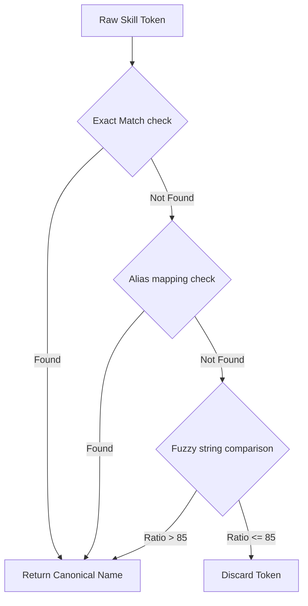

# Candidate Transformer: A Trust-Aware Evidence Fusion Pipeline Architecture

This document provides a highly detailed architectural, functional, and developer-level breakdown of the Multi-Source Candidate Data Transformer: a trust-aware evidence fusion pipeline.

---

## 1. System-Level Pipeline Architecture Flow

The pipeline ingests candidate data from multiple sources (both structured and unstructured) and processes them through an 11-stage, type-safe, claim-based pipeline:

```
[Inputs] ➔ Input Validator ➔ Source Detector ➔ Extractors ➔ Raw Claim Builder ➔ Normalization Engine ➔ Alignment & Grouping ➔ Arbitration Engine ➔ Canonical Builder ➔ Custom Config Projector ➔ Schema Validator ➔ [API/UI JSON Output]
```

### End-to-End Execution Sequence
1. **Input Validation (`pipeline.py`)**: Checks that execution arguments are present and verifies that at least one candidate document path (`csv_path` or `resume_path`) is supplied.
2. **Source Detection (`source_detector.py`)**: Classifies raw file streams into `csv`, `pdf`, `image_pdf`, `docx`, or `unknown`. Uses a scanned PDF check that calculates the density of characters in the first 3 pages. If there are fewer than 100 characters, it flags the document as `image_pdf`, bypassing standard text-based extractors.
3. **Claims Extraction (`csv_extractor.py`, `resume_extractor.py`)**: Extracts raw text blocks. Structured CSV files map headers to canonical fields using fuzzy column name heuristics. Unstructured resumes segment layout boundaries (CONTACT, EXPERIENCE, EDUCATION, SKILLS) before running regular expression capture groups and taxonomy alignments.
4. **Claim Compilation (`models.py`)**: Encapsulates raw extracted values into immutable `Claim` objects documenting the source file, extraction method, position in the document, and a raw confidence weight.
5. **Normalization Engine (`normalizer.py`)**: Standardizes text formats: E.164 phone formats (via Google `phonenumbers`), Title Case name formatting, ISO-3166 country mapping, YYYY-MM dates, and skills taxonomy alignments.
6. **Evidence Alignment & Identity Resolution (`arbitration.py`)**: Groups all normalized evidence claims by the candidate's primary email identity.
7. **Evidence Arbitration (`arbitration.py`)**: Performs field merging:
   - **Union Strategy**: Pools and dedupes list-based evidence (emails, phones, skills, experience, education), boosting identical entries with a **+0.15 corroboration bonus**.
   - **Highest Confidence Strategy**: Resolves single-value evidence fields (name, location, headline) based on source and method trust weights.
   - **Conflict Detection**: Compares winning evidence claims against competing claims; if the confidence margin is <= 0.05, a conflict flag is raised in provenance.
8. **Years of Experience Union (`arbitration.py`)**: Resolves concurrent jobs and overlapping contracts by projecting timelines onto a unified array of work months, counting only the net sum of non-overlapping months.
9. **Canonical Profile Builder (`canonical_builder.py`)**: Creates a secure, immutable `CanonicalCandidate` object with a unique SHA-256 ID.
10. **Output Projector (`projector.py`)**: Reshapes outputs at runtime by evaluating dot-notation paths (e.g. `emails[0]`, `experience[0].company`) onto client-specified fields, honoring global toggles for confidence and provenance. Under custom configurations, the output `provenance` records are dynamically filtered to only include entries matching the selected custom fields.
11. **Pydantic Schema Validation (`validator.py`)**: Runs projected schemas through structural models to verify required fields and types, generating diagnostic warning and error collections.

---

## 2. Exhaustive Module Breakdown

### `app/pipeline/models.py`
Defines the Pydantic data schemas representing the engine's data structures:
- **`Claim`**: Stores the raw extracted value, target field, extraction method (enum), document position (enum), source type (structured vs unstructured), source filename, confidence score, and normalization status.
- **`SkillClaim`** (inherits `Claim`): Adds skills metadata (match type, canonical name, fuzzy score).
- **`ExperienceEntry`**: Represents parsed career roles (company, title, start, end, summary, concurrency flag, sources list, confidence).
- **`EducationEntry`**: Represents parsed academic history (institution, degree, field, graduation end year, sources list, confidence).
- **`ProvenanceRecord`**: Represents the audit trail and resolution history for a specific canonical field.
- **`CanonicalCandidate`**: Represents the finalized profile. Contains fields, provenance records, processed source names, overall confidence, run timestamp, and warnings.
- **`ProjectionConfig`**: Defines field cast specifications for dynamic reshaping.

### `app/pipeline/source_detector.py`
- **Logic**: Inspects file headers using magic number byte checks to classify raw documents into `csv`, `pdf`, `image_pdf`, `docx`, or `unknown`.
- **Scanned PDF Check**: Iterates through the first 3 pages using `pdfplumber`. If the total extracted characters are less than 100, the PDF is flagged as scanned (`image_pdf`), bypassing normal text stream extractors.
- **Header Verification**: Inspects columns for CSV files to log alerts if no recognizable candidate fields are found.

### `app/pipeline/extractors/csv_extractor.py`
- **Logic**: Processes recruiter spreadsheets. Maps headers to canonical fields using fuzzy column name heuristics (e.g. "Full Name", "Candidate Name", "name" map to `full_name`).
- **Confidence**: Assigns a high baseline score of 0.95, representing data from verified, structured databases.

### `app/pipeline/extractors/resume_extractor.py`
- **Logic**: Splits unstructured resumes page-by-page.
- **OCR Fallback**: Integrates pip-installable `easyocr` (English model, running GPU-free) to perform Optical Character Recognition (OCR) on rendered page images of scanned PDFs (`image_pdf`).
- **Section Segmentation**: Scans for standard headers (e.g. "Work Experience", "Education", "Technical Skills") using regex matches to partition the document into section strings (limiting searching scopes).
- **Inline Date/Company Parsing**: Matches date ranges in experience blocks. If a date pattern (e.g. `Feb 2026 - Present`) matches, it extracts the line prefix preceding the match and registers it as the company name.
- **Skills Taxonomy Match**: Tokenizes text using delimiters (commas, pipes, bullets) and maps them against a taxonomy ontology using exact checks, alias matching, and fuzzy string ratios (via `rapidfuzz` > 85).

### `app/pipeline/normalizer.py`
- **Phone Formatting**: Uses the Google `phonenumbers` library, verifying formatting using regional presets (defaulting to IN, falling back to US, then global).
- **Date Normalization**: Matches verbal month abbreviations (e.g. "Jun", "Sept") and maps them to numeric formats (`06`, `09`) alongside a 4-digit year.
- **Country Codes**: Matches city text against major lists to normalize country keys to standard ISO-3166 alpha-2 formats.

### `app/pipeline/arbitration.py`
- **Union Strategy**: Dedupes lists, boosting identical entries by +0.15 confidence.
- **Highest Confidence Strategy**: Compares all single-value claims and picks the one with the highest confidence. Logs conflict markers if competing values have close confidence scores (margin <= 0.05).
- **Timeline Intersection Calculator**: 
  - Converts start and end dates to a numeric month value.
  - Combines overlapping intervals using range union math.
  - Computes final years of experience: `total_months / 12` rounded to 1 decimal place.

### `app/pipeline/projector.py`
- **Logic**: Reshapes canonical candidate profiles using paths at runtime.
- **Dot-Notation Selectors**: Recursively resolves indexes like `emails[0]` or nested fields like `experience[0].company` by splitting selectors.
- **On Missing Behaviors**: Appends nulls, deletes fields (`omit`), or triggers structural errors (`error`) based on the active config configuration.

### `app/pipeline/validator.py`
- **Logic**: Validates projected records against structural layouts using dynamic Pydantic models. Returns error details if checks fail.

---

## 3. Mathematical Arbitration Formulas

### 1. Confidence Weight Calculation
The confidence score of a claim is determined by the following parameters:
- $W_{source}$: Source type weight (Structured = 1.00, Unstructured = 0.70)
- $W_{method}$: Extraction method weight (Column map = 1.00, Regex contact block = 0.95, Regex section body = 0.85, Heuristics = 0.70)
- $W_{position}$: Document position weight (Explicit field = 1.00, Contact block = 1.00, Named section = 0.90, Prose body = 0.65)
- $M_{skill}$: Match multiplier (for skills: Exact match = 1.00, Alias match = 0.95, Fuzzy match = 0.75)

$$\text{Base Confidence} = W_{source} \times W_{method} \times W_{position} \times M_{skill}$$

### 2. Corroboration Bonus
When identical claims for list fields are extracted from different files, a corroboration bonus is added:

$$\text{Final Confidence} = \text{Base Confidence} + (\text{Number of corroborating sources} - 1) \times 0.15$$

### 3. Net Experience Timeline Union
Let a set of employment intervals be $I = \{[S_i, E_i]\}$, where $S_i$ and $E_i$ represent the start and end months since a fixed epoch.
To resolve overlaps:
1. Sort intervals by start month: $S_1 \le S_2 \le \dots \le S_n$.
2. Merge overlapping intervals: If $S_{k+1} \le E_k$, set $E_k = \max(E_k, E_{k+1})$ and discard $I_{k+1}$.
3. Repeat until all remaining intervals are disjoint.
4. Calculate total experience:

$$\text{Total Years} = \frac{\sum (E_j - S_j + 1)}{12}$$

---

## 4. Skills Taxonomy Ontologies

The pipeline matches text strings against a JSON taxonomy file using three lookup layers:



1. **Exact Match**: The normalized token is checked against keys in the taxonomy database.
2. **Alias Mapping**: The token is mapped against the aliases array defined for each canonical skill.
3. **Fuzzy String Comparison**: Leverages the RapidFuzz Levenshtein distance calculation to compare tokens. Matches with a score above 85 are accepted.
